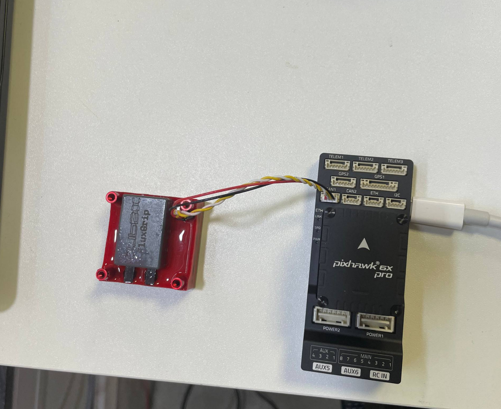
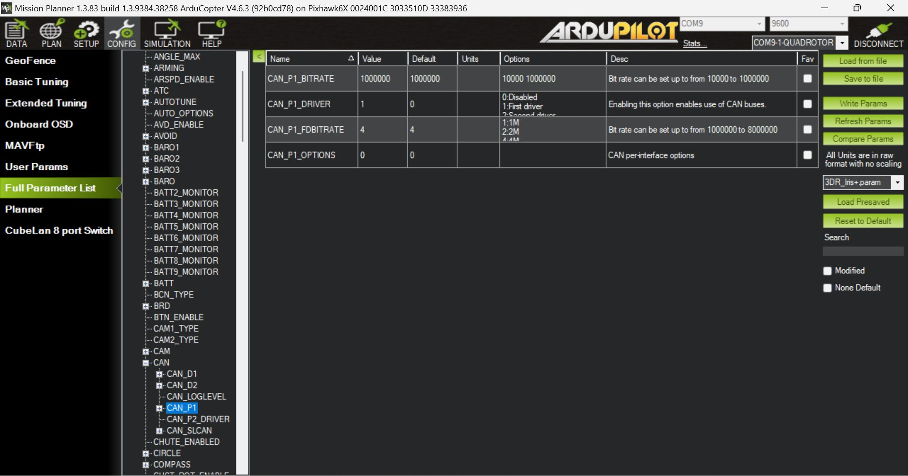
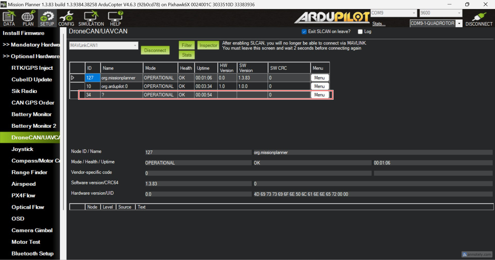
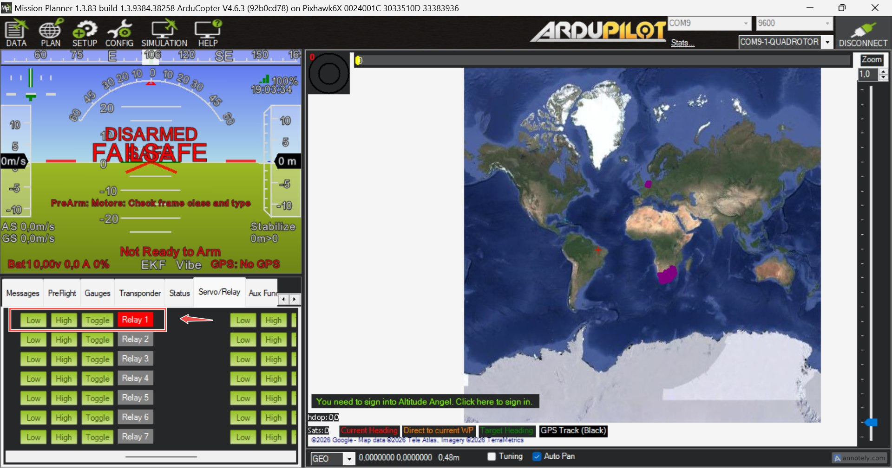

.. _common-electro-permanent-magnet:

================================
Electro-Permanent Magnet (EPM)
================================

This page explains how to connect a `Zubax FluxGrip <https://fluxgrip.zubax.com/>`__
electro-permanent magnet to an autopilot over DroneCAN.  FluxGrip can be
controlled using ArduPilot's DroneCAN virtual-relay support, so no custom
firmware or Lua script is required.

.. note::

   This procedure was tested with ArduCopter 4.7.0 and FluxGrip firmware
   revision ``502e1f5``.  See the `FluxGrip integration forum post
   <https://forum.zubax.com/t/fluxgrip-integration-with-ardupilot/2862>`__
   for additional instructions, videos, and troubleshooting information.

Connecting FluxGrip
===================

Connect FluxGrip to the autopilot's CAN1 port.  Follow the
:ref:`DroneCAN wiring and termination instructions <common-uavcan-setup-advanced>`.

An external power supply for FluxGrip is recommended.  Switching the magnet
can briefly draw a large current; a separate supply speeds up switching and
avoids loading the autopilot's peripheral power rail.  Refer to the
`FluxGrip reference manual <https://fluxgrip.zubax.com/>`__ for its power
supply requirements.

   FluxGrip connected to CAN1 on a Pixhawk 6X Pro.

Configuring DroneCAN
====================

In Mission Planner, connect to the autopilot and open **Config > Full
Parameter List**.

#. Set :ref:`CAN_P1_DRIVER<CAN_P1_DRIVER>` to ``1``.  Select **Write Params**
   and then **Refresh Params** so the parameters for driver 1 become visible.
#. Set :ref:`CAN_P1_BITRATE<CAN_P1_BITRATE>` to ``1000000`` and
   :ref:`CAN_D1_PROTOCOL<CAN_D1_PROTOCOL>` to ``1`` (DroneCAN).
#. Write the parameters and reboot the autopilot.

This maps physical port CAN1 to virtual CAN driver 1, with DroneCAN as the
driver protocol.

   CAN1 configured to use DroneCAN driver 1.

After rebooting, reconnect and refresh the full parameter list.  Set:

- :ref:`CAN_D1_UC_NODE<CAN_D1_UC_NODE>` to an unused DroneCAN node ID, for
  example ``10``.
- :ref:`CAN_D1_UC_RLY_RT<CAN_D1_UC_RLY_RT>` to ``10`` to transmit remote
  relay state at 10 Hz.

Write the parameters and reboot the autopilot again.

.. note::

   If FluxGrip is connected to another CAN port or that port is assigned to
   another virtual driver, use the corresponding ``CAN_Px_`` and ``CAN_Dx_``
   parameters instead.

Verifying DroneCAN communication
================================

When communication is working, FluxGrip's CAN indicators show one steady
indicator for the connection and one blinking indicator for CAN traffic.

In Mission Planner, open **Setup > Optional Hardware > DroneCAN/UAVCAN**,
select ``MAVLinkCAN1``, and select **Connect**.  FluxGrip should appear in the
node list.

   FluxGrip visible as a DroneCAN node in Mission Planner.

If FluxGrip does not appear, check the CAN wiring, bus termination, bitrate,
power supply, and the parameters above.

.. warning::

   On a Pixhawk 6X Pro, an IOMCU firmware update error may stop startup before
   CAN is initialized.  Setting :ref:`BRD_IO_ENABLE<BRD_IO_ENABLE>` to ``2``
   enables the IOMCU without attempting an update and can be used for bench
   diagnosis.  Do not fly with an unresolved IOMCU firmware problem.

Configuring FluxGrip as a DroneCAN relay
========================================

FluxGrip uses DroneCAN hardpoint ID 0.  ArduPilot maps this hardpoint to
virtual relay pin 1000.

#. Set :ref:`RELAY1_FUNCTION<RELAY1_FUNCTION>` to ``1`` (Relay), select
   **Write Params**, and then select **Refresh Params**.
#. Set the remaining relay parameters:

   - :ref:`RELAY1_PIN<RELAY1_PIN>` = ``1000`` (DroneCAN hardpoint ID 0)
   - :ref:`RELAY1_DEFAULT<RELAY1_DEFAULT>` = ``2`` (NoChange)
   - :ref:`RELAY1_INVERTED<RELAY1_INVERTED>` = ``0``
   - :ref:`GRIP_ENABLE<GRIP_ENABLE>` = ``0``

#. Write the parameters and reboot the autopilot.

This configuration uses the relay subsystem instead of ArduPilot's gripper
backend.  Use relay controls and ``DO_SET_RELAY`` rather than ``DO_GRIPPER``.

Controlling FluxGrip
====================

FluxGrip can be tested while the vehicle is disarmed.  In Mission Planner,
open **Data > Servo/Relay** and operate the first relay:

- **High/On** magnetizes FluxGrip to grip and hold the payload.
- **Low/Off** demagnetizes FluxGrip to release the payload.

   Controlling FluxGrip using the first relay in Mission Planner.

For mission control, add a :ref:`MAV_CMD_DO_SET_RELAY
<mav_cmd_do_set_relay>` command with relay number ``0`` and set its state to
``1`` to grip or ``0`` to release.  For pilot control, set an ``RCx_OPTION``
to ``Relay 1 On/Off``.  See :ref:`common-relay` for more relay control
options.

.. note::

   ArduPilot parameters name the first relay ``RELAY1``, while MAVLink numbers
   the same relay as relay 0.

Before flight, test both grip and release with the intended payload and power
supply.  At startup the magnet may report an unknown/detect state, so command
and verify the desired state.  A rapidly blinking magnet status indicator
means that magnetization failed; contact `Zubax Robotics
<https://zubax.com/contact>`__ for assistance.
